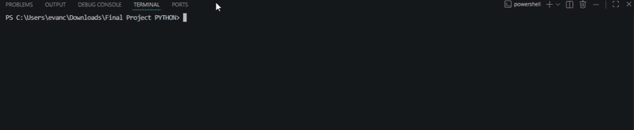

# Netflix Data Visor



Demonstración: https://youtu.be/Q6ecN9GK7x8

Un programa en Python que lee tus datos de visualizacion y facturacion de Netflix y te muestra estadisticas interesantes. Creado para CS50P de Harvard.

## Que Hace

Netflix te permite descargar todos tus datos - cada serie que has visto, cada dolar que has gastado. Pero los archivos son solo CSVs sin procesar. Este programa los hace legibles.

Elegis un perfil (o todos), y despues seleccionas una opcion del menu:

1. **Total Gastado** - cuanto has pagado desde que te uniste. Pregunta si queres convertir a PYG.
2. **Series Mas Vistas** - top 5 series ordenadas por tiempo de visualizacion.
3. **Peliculas Mas Vistas** - lo mismo, pero para peliculas.
4. **Tiempo Total Visto** - todas tus horas combinadas en un solo numero.
5. **Costo Por Hora** - total gastado dividido por total de horas.

Automaticamente omite trailers, hooks y vistas previas de autoplay para que tu tiempo real de visualizacion no se infle.

## Como Obtener Tus Datos de Netflix

1. Netflix -> Cuenta -> Descargar tu informacion personal
2. Espera el correo (normalmente menos de un dia)
3. Descarga y descomprimi el archivo
4. Vas a obtener una carpeta con un nombre como `1343059170`
5. Dentro, el programa usa dos carpetas:
      CONTENT_INTERACTION/ViewingActivity.csv
      PAYMENT_AND_BILLING/BillingHistory.csv

## Como Ejecutar

```bash
pip install -r requirements.txt
python project.py C:\Users\you\Downloads\1343059170
```

O simplemente `python project.py` y escribi la ruta cuando te la pida.

## Archivos

   project.py - el programa completo. Menu, funciones de analisis, todo.
   test_project.py - tests para las funciones principales.
   requirements.txt - las bibliotecas necesarias: pandas y requests.

## Datos de Muestra

La carpeta `sample_data/` contiene datos falsos de ejemplo. Probalos con:

```bash
python project.py sample_data
```
